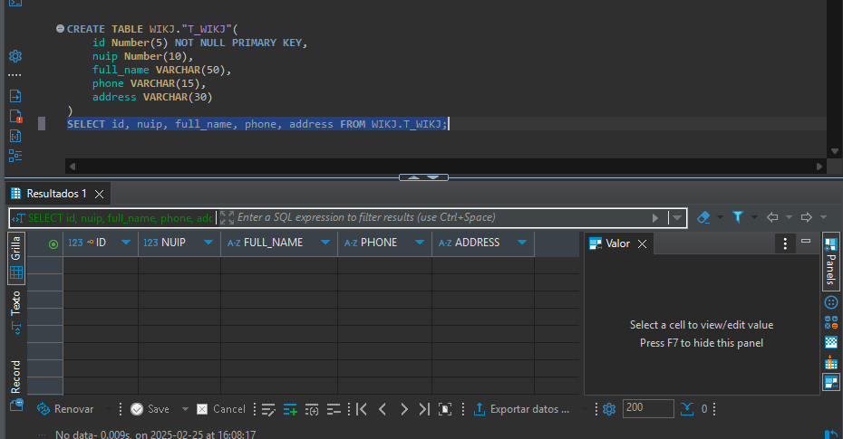

# Documentación Prueba técnica APX

## APX  📑

## Tabla de contenidos
- [Introducción](#introducción)
- [Requisitos del proyecto ](#requisitos-del-proyecto)
- [Especificaciones del sistema ](#especificaciones-del-sistema)
- [Supuestos ](#supuestos)
- [Configuraciones ](#configuraciones)
- [Autor ](#autor)

### Introducción
- En este escenario, nos enfrentamos al desafío de almacenar la información de un cliente en una base de datos Oracle mediante un proceso de inserción. Para garantizar la consistencia y cumplir con ciertos estándares, se han establecido restricciones y requisitos específicos que deben ser seguidos rigurosamente.

        

### Requisitos del proyecto  
✅

- El nombre de la tabla debe estar dentro del esquema WIKJ y debe tener el nombre T_WIKJ_HAB_PRUEBAFINAL
- Los campos necesarios para la tabla son los siguientes
  - id Number(5) NOT NULL PRIMARY KEY, nuip Number(10), full_name VARCHAR(50), phone VARCHAR(15), address VARCHAR(30)
- Se debe validar antes de hacer la inserción de la información que el nuip no exista previamente, es decir, no está permitido sobreescribir ningún registro y/o duplicar un registro por el nuip.
  
 
    

### Especificaciones del sistema  
💻

- especificaciones
    - Java
    - Intellij
    - DOCKER
    - POSTMAN
    - DBeaver
    - Entorno APX
    - Oracle BD
    - Contenedor proporcionado en clase

### Supuestos 
- No pude probarlo con el entorno pero realice todo la logica

### Configuraciones 
##  **⚙️**

- Ejecucucion del programa
  
        

### Autor 
👨‍💻
***José Luis Ruiz Chavez***   

*JVB01SM*
